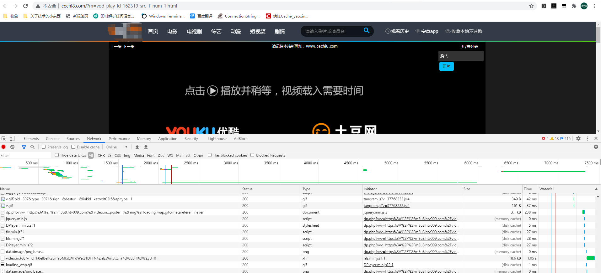
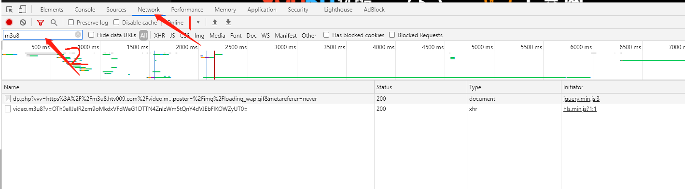
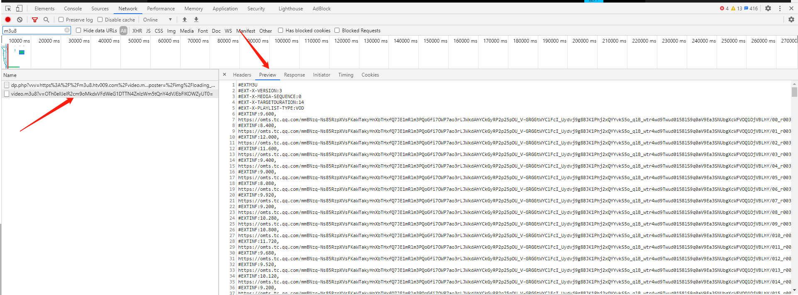
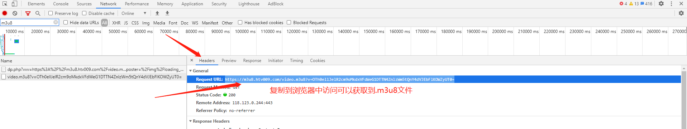

# m3u8Manager
A m3u8 download management tool with GOlang  language


# M3U8下载器思路整理

## 	m3u8简介

* m3u8文件是苹果公司使用的HTTP Live Streaming（HLS）协议格式的基础。HLS是新一代流媒体传输协议，其基本实现原理为将一个大的媒体文件进行分片，将该分片文件资源路径记录与m3u8文件（即playlist）内，其中附带一些额外描述（比如该资源的多带宽信息等...）用于提供给客户端。客户端依据该m3u8文件可获取对应的媒体资源，进行播放。因此，客户端获取HLS流文件，主要是对m3u8文件进行解析操作。

* m3u8文件实质是一个播放列表（playlist），其可能是一个媒体播放列表（Media Playlist），或者是一个主列表（Master Playlist）。但无论是哪种播放列表，其内部文字使用的都是utf-8编码。

## m3u8文件简介

* m3u8 文件实质是一个播放列表（playlist），其可能是一个媒体播放列表（Media Playlist），或者是一个主列表（Master Playlist）。但无论是哪种播放列表，其内部文字使用的都是 utf-8 编码。

* 当 m3u8 文件作为媒体播放列表（Meida Playlist）时，其内部信息记录的是一系列媒体片段资源，顺序播放该片段资源，即可完整展示多媒体资源。其格式如下所示

  * 绝对地址：

  * ```
    #EXTM3U
    #EXT-X-VERSION:3
    #EXT-X-MEDIA-SEQUENCE:0
    #EXT-X-TARGETDURATION:14
    #EXT-X-PLAYLIST-TYPE:VOD
    #EXTINF:9.600,
    https://omts.tc.qq.com/mmBNzq-Ns85RzpXVsFKaWTakyHnXbTHxfQ7JE1mRlm3PQoGfi7OWP7ao3rLJWkdAhYCkGyRP2p25pDU_V-GRGGtWYClFcI_Uydvj9g8BJK1Phj2xQYYvkS5o_qlB_wtr4wd9Twud0158lS9q0aV9Ea3SNUbgXcWFVOQ1OjVBLhY/00_r00348nn5fz.321004.1.ts?index=0&start=0&end=9600&brs=0&bre=1709107&ver=4&token=8ab36538f3f2885cca57d54dd4c5a76b
    #EXTINF:8.400,
    https://omts.tc.qq.com/mmBNzq-Ns85RzpXVsFKaWTakyHnXbTHxfQ7JE1mRlm3PQoGfi7OWP7ao3rLJWkdAhYCkGyRP2p25pDU_V-GRGGtWYClFcI_Uydvj9g8BJK1Phj2xQYYvkS5o_qlB_wtr4wd9Twud0158lS9q0aV9Ea3SNUbgXcWFVOQ1OjVBLhY/01_r00348nn5fz.321004.1.ts?index=1&start=9600&end=18000&brs=1709108&bre=3501311&ver=4&token=770bf9a642ef3399e479270693d96d18
    ··········
    #EXTINF:12.000,
    https://omts.tc.qq.com/mmBNzq-Ns85RzpXVsFKaWTakyHnXbTHxfQ7JE1mRlm3PQoGfi7OWP7ao3rLJWkdAhYCkGyRP2p25pDU_V-GRGGtWYClFcI_Uydvj9g8BJK1Phj2xQYYvkS5o_qlB_wtr4wd9Twud0158lS9q0aV9Ea3SNUbgXcWFVOQ1OjVBLhY/0360_r00348nn5fz.321004.12.ts?index=360&start=3713080&end=3725080&brs=63107652&bre=64644551&ver=4&token=544d1644fd15cdab56ede4aa82115838
    #EXTINF:6.674,
    https://omts.tc.qq.com/mmBNzq-Ns85RzpXVsFKaWTakyHnXbTHxfQ7JE1mRlm3PQoGfi7OWP7ao3rLJWkdAhYCkGyRP2p25pDU_V-GRGGtWYClFcI_Uydvj9g8BJK1Phj2xQYYvkS5o_qlB_wtr4wd9Twud0158lS9q0aV9Ea3SNUbgXcWFVOQ1OjVBLhY/0361_r00348nn5fz.321004.12.ts?index=361&start=3725080&end=3731754&brs=64644552&bre=65276983&ver=4&token=8915a7baab8cd1714b3d6e1b633be303
    #EXT-X-ENDLIST
    ```

    

  * 相对地址：

    ``` 
    #EXTM3U
    #EXT-X-VERSION:3
    #EXT-X-TARGETDURATION:6
    #EXT-X-MEDIA-SEQUENCE:0
    #EXTINF:1.416667,
    v.f230.ts?start=0&end=282375&type=mpegts
    #EXTINF:2.875000,
    v.f230.ts?start=282376&end=675671&type=mpegts
    #EXTINF:1.708333,
    v.f230.ts?start=675672&end=905595&type=mpegts
    #EXTINF:3.208333,
    v.f230.ts?start=905596&end=1271255&type=mpegts
    #EXTINF:2.000000,
    v.f230.ts?start=1271256&end=1441395&type=mpegts
    #EXTINF:2.000000,
    v.f230.ts?start=1441396&end=1843151&type=mpegts
    #EXTINF:2.000000,
    v.f230.ts?start=1843152&end=2221031&type=mpegts
    #EXTINF:2.000000,
    v.f230.ts?start=2221032&end=2519199&type=mpegts
    #EXTINF:3.708333,
    v.f230.ts?start=2519200&end=3327035&type=mpegts
    #EXTINF:5.791667,
    v.f230.ts?start=3327036&end=4192587&type=mpegts
    #EXTINF:3.375000,
    v.f230.ts?start=4192588&end=4612015&type=mpegts
    #EXT-X-ENDLIST
    ```

    TIP：

    绝对地址:可以直接通过链接获取到ts视频切片，无需进行地址补全

    相对路径:是需要进行地址补全以后才可以获取到ts视频切片

  * 当m3u8作为主播放列表（Master Playlist）时，其内部提供的是同一份媒体资源的多份流列表资源（Variant Stream）。其格式如下所示：

    ```
    #EXTM3U
    #EXT-X-STREAM-INF:BANDWIDTH=150000,RESOLUTION=416x234,CODECS="avc1.42e00a,mp4a.40.2"
    http://example.com/low/index.m3u8
    #EXT-X-STREAM-INF:BANDWIDTH=240000,RESOLUTION=416x234,CODECS="avc1.42e00a,mp4a.40.2"
    http://example.com/lo_mid/index.m3u8
    #EXT-X-STREAM-INF:BANDWIDTH=440000,RESOLUTION=416x234,CODECS="avc1.42e00a,mp4a.40.2"
    http://example.com/hi_mid/index.m3u8
    #EXT-X-STREAM-INF:BANDWIDTH=640000,RESOLUTION=640x360,CODECS="avc1.42e00a,mp4a.40.2"
    http://example.com/high/index.m3u8
    #EXT-X-STREAM-INF:BANDWIDTH=64000,CODECS="mp4a.40.5"
    http://example.com/audio/index.m3u8
    ```

    可以看到当前m3u8文件是由多个m3u8组合而成,该备用流资源也可同时提供不同版本的资源内容，比如不同语言的音频文件，不同角度拍摄的视频文件,直播的时候切换不同的清晰度等等。客户可以根据不同的网络状态选取合适码率的资源，并且最好根据用户喜好选择合适的资源码率。

 # m3u8文件获取教程

​    

测试视频地址：http://cechi8.com/?m=vod-play-id-162519-src-1-num-1.html

浏览器：Google 浏览器

1. 打开浏览器，开启开发者模式(  **F12**  )

2. 复制视频地址到导航栏获取视频页面

   

3. 切换到NetWork，过滤 m3u8 以外的文件

   

4. 获取到m3u8文件后查看对应的文件获取到播放列表(有些会获取到多个m3u8文件,只有包含播放列表的文件才是真正可以获取视频的链接)

   

5. 找到m3u8文件后 ,保存方式二选一

   1. 可以选择创建一个 .txt 文件保存

   2. 通过请求地址来获取m3u8文件

      

## m3u8文件格式详解

m3u8 的文件格式主要包含三方面内容：

1. **[文件播放列表格式定义](https://links.jianshu.com/go?to=https%3A%2F%2Ftools.ietf.org%2Fhtml%2Frfc8216%23page-10)**：播放列表（Playlist，也即 m3u8 文件） 内容需严格满足[规范定义](https://links.jianshu.com/go?to=https%3A%2F%2Ftools.ietf.org%2Fhtml%2Frfc8216%23page-10)所提要求。下面罗列一些主要遵循的条件：

- m3u8 文件必须以 utf-8 进行编码，不能使用 Byte Order Mark（BOM）字节序， 不能包含 utf-8 控制字符（U+0000 ~ U_001F 和 U+007F ~ u+009F）。
- m3u8 文件的每一行要么是一个 URI，要么是空行，要么就是以 **#** 开头的字符串。不能出现空白字符，除了显示声明的元素。
- m3u8 文件中以 **#** 开头的字符串要么是注释，要么就是标签。标签以 **#EXT** 开头，大小写敏感。

1. **[属性列表（Attribute Lists）](https://links.jianshu.com/go?to=https%3A%2F%2Ftools.ietf.org%2Fhtml%2Frfc8216%23page-11)**：某些特定的标签的值为属性列表。标签后面的属性列表以 *逗号* 作为分隔符，分离出多组不带空格的 *属性/值* 对。
   **属性/值** 对的语法格式如下：

```txt
AttributeName=AttributeValue
```

其中：

- **属性`AttributeName`**是由 [A..Z],[0..9] 和 `-` 组成的不带引号的字符串。因此，**属性`AttributeName`只能使用大写字母，不能使用小写字母**，并且`AttributeName`和`=`中间不能有空格，同理，`=`和`AttributeValue`之间也不能有空格。
- **值`AttributeValue`**的只能取以下类型：
  - **十进制整型（decimal-interger）**：由 [0..9] 之间组成的十进制不带引号的字符串，范围为  ~ （18446744073709551615），字符长度为 1 ~ 20 之间。
  - **十六进制序列**：由 [0..9] 和 [A..F] 且前缀为 0x 或 0X 组合成的不带引号的字符串。其序列的最大长度取决于他的属性名`AttributeNames`。
  - **带符号十进制浮点型（signed-decimal-floating-point）**：由 [0..9]，`-`和`.`组合成的不带引号的字符串。
  - **字符串（quoted-string）**：由双引号包裹表示的字符串。其中，0xA，0xD 和 双引号`"`不能出现在该字符串中。该字符串区分大小写。
  - **可枚举字符串（enumerated-string）**：由`AttributeName`显示定义的一系列不带引号的字符串。该字符串不能包含双引号`"`，逗号`,`和空白字符。
  - **decimal-resolution**：由字符`x`进行隔离的两个十进制整型数。第一个整型表示水平宽度大小，第二个整型数表示垂直方向高度大小（单位：像素）。

1. **[标签](https://links.jianshu.com/go?to=https%3A%2F%2Ftools.ietf.org%2Fhtml%2Frfc8216%23page-12)**：标签用于指定 m3u8 文件的全局参数或在其后面的切片文件/媒体播放列表的一些信息。

标签的类型可分为五种类型：**[基础标签（Basic Tags）](https://links.jianshu.com/go?to=https%3A%2F%2Ftools.ietf.org%2Fhtml%2Frfc8216%23section-4.3.1)**，**[媒体片段类型标签（Media Segment Tags）](https://links.jianshu.com/go?to=https%3A%2F%2Ftools.ietf.org%2Fhtml%2Frfc8216%23page-13)**，**[媒体播放列表类型标签](https://links.jianshu.com/go?to=https%3A%2F%2Ftools.ietf.org%2Fhtml%2Frfc8216%23page-22)**，**[主播放列表类型标签](https://links.jianshu.com/go?to=https%3A%2F%2Ftools.ietf.org%2Fhtml%2Frfc8216%23page-25)** 和 **[播放列表类型标签](https://links.jianshu.com/go?to=https%3A%2F%2Ftools.ietf.org%2Fhtml%2Frfc8216%23page-35)**。其具体内容如下所示：

- **[基础标签（Basic Tags）](https://links.jianshu.com/go?to=https%3A%2F%2Ftools.ietf.org%2Fhtml%2Frfc8216%23section-4.3.1)**：可同时适用于媒体播放列表（Media Playlist）和主播放列表（Master Playlist）。具体标签如下：

  - **[EXTM3U](https://links.jianshu.com/go?to=https%3A%2F%2Ftools.ietf.org%2Fhtml%2Frfc8216%23page-12)**：表明该文件是一个 m3u8 文件。每个 [M3U](https://links.jianshu.com/go?to=https%3A%2F%2Fzh.wikipedia.org%2Fwiki%2FM3U) 文件必须将该标签放置在第一行。
  - **[EXT-X-VERSION](https://links.jianshu.com/go?to=https%3A%2F%2Ftools.ietf.org%2Fhtml%2Frfc8216%23page-12)**：表示 [HLS](https://links.jianshu.com/go?to=https%3A%2F%2Fzh.wikipedia.org%2Fwiki%2FHTTP_Live_Streaming) 的协议版本号，该标签与流媒体的兼容性相关。该标签为全局作用域，使能整个 m3u8 文件；每个 m3u8 文件内最多只能出现一个该标签定义。如果 m3u8 文件不包含该标签，则默认为协议的第一个版本。

- **[媒体片段类型标签（Media Segment Tags）](https://links.jianshu.com/go?to=https%3A%2F%2Ftools.ietf.org%2Fhtml%2Frfc8216%23page-13)**：每个切片 URI 前面都有一系列媒体片段标签对其进行描述。有些片段标签只对其后切片资源有效；有些片段标签对其后所有切片都有效，直到后续遇到另一个该标签描述。**媒体片段类型标签不能出现在主播放列表（Master Playlist）中**。具体标签如下：

  - **[EXTINF](https://links.jianshu.com/go?to=https%3A%2F%2Ftools.ietf.org%2Fhtml%2Frfc8216%23page-13)**：表示其后 URL 指定的媒体片段时长（单位为秒）。每个 URL 媒体片段之前必须指定该标签。该标签的使用格式为：

    ```m3u8
    #EXTINF:<duration>,[<title>]
    ```

    其中：

    - `duration`：可以为十进制的整型或者浮点型，其值必须小于或等于 **EXT-X-TARGETDURATION** 指定的值。
      注：建议始终使用浮点型指定时长，这可以让客户端在定位流时，减少四舍五入错误。但是如果兼容版本号 **EXT-X-VERSION** 小于 3，那么必须使用整型。

  - **[EXT-X-BYTERANGE](https://links.jianshu.com/go?to=https%3A%2F%2Ftools.ietf.org%2Fhtml%2Frfc8216%23page-14)**：该标签表示接下来的切片资源是其后 URI 指定的媒体片段资源的局部范围（即截取 URI 媒体资源部分内容作为下一个切片）。该标签只对其后一个 URI 起作用。其格式为：

    ```m3u8
    #EXT-X-BYTERANGE:<n>[@<o>]
    ```

    其中：

    - `n`是一个十进制整型，表示截取片段大小（单位：字节）。

- 可选参数`o`也是一个十进制整型，指示截取起始位置（以字节表示，在 URI 指定的资源开头移动该字节位置后进行截取）。
      如果`o`未指定，则截取起始位置从上一个该标签截取完成的下一个字节（即上一个`n+o+1`）开始截取。
    如果没有指定该标签，则表明的切分范围为整个 URI 资源片段。
      注：使用 **EXT-X-BYTERANGE** 标签要求兼容版本号 **EXT-X-VERSION** 大于等于 4。

  - **[EXT-X-DISCONTINUITY](https://links.jianshu.com/go?to=https%3A%2F%2Ftools.ietf.org%2Fhtml%2Frfc8216%23page-14)**：该标签表明其前一个切片与下一个切片之间存在中断。其格式为：

    ```m3u8
    #EXT-X-DISCONTINUITY
    ```

    当以下任一情况变化时，必须使用该标签：

    - 文件格式（file format）

  - 数字（number），类型（type），媒体标识符（identifiers of tracks）

    - 时间戳序列（timestamp sequence）

    当以下任一情况变化时，应当使用该标签：

    - 编码参数（encoding parameters）

  - 编码序列（encoding sequence）

  注：**EXT-X-DISCONTINUITY** 的一个经典使用场景就是在视屏流中插入广告，由于视屏流与广告视屏流不是同一份资源，因此在这两种流切换时使用 **EXT-X-DISCONTINUITY** 进行指明，客户端看到该标签后，就会处理这种切换中断问题，让体验更佳。
   更多详细内容，请查看：[Incorporating Ads into a Playlist](https://links.jianshu.com/go?to=https%3A%2F%2Fdeveloper.apple.com%2Fdocumentation%2Fhttp_live_streaming%2Fexample_playlists_for_http_live_streaming%2Fincorporating_ads_into_a_playlist)

  - **[EXT-X-KEY](https://links.jianshu.com/go?to=https%3A%2F%2Ftools.ietf.org%2Fhtml%2Frfc8216%23page-15)**：媒体片段可以进行加密，而该标签可以指定解密方法。
    该标签对所有 *媒体片段* 和 由标签 **EXT-X-MAP** 声明的围绕其间的所有 *媒体初始化块（Meida Initialization Section）* 都起作用，直到遇到下一个 **EXT-X-KEY**（若 m3u8 文件只有一个 **EXT-X-KEY** 标签，则其作用于所有媒体片段）。
     多个 **EXT-X-KEY** 标签如果最终生成的是同样的秘钥，则他们都可作用于同一个媒体片段。
    该标签使用格式为：

  ```m3u8
    #EXT-X-KEY:<attribute-list>
  ```

  属性列表可以包含如下几个键：

    - **METHOD**：该值是一个可枚举的字符串，指定了加密方法。
      该键是必须参数。其值可为`NONE`，`AES-128`，`SAMPLE-AES`当中的一个。
      其中：
      `NONE`：表示切片未进行加密（此时其他属性不能出现）；
      `AES-128`：表示表示使用 [AES-128](https://links.jianshu.com/go?to=https%3A%2F%2Ftools.ietf.org%2Fhtml%2Frfc8216%23ref-AES_128) 进行加密。
       `SAMPLE-AES`：意味着媒体片段当中包含样本媒体，比如音频或视频，它们使用 [AES-128](https://links.jianshu.com/go?to=https%3A%2F%2Ftools.ietf.org%2Fhtml%2Frfc8216%23ref-AES_128) 进行加密。这种情况下 **IV** 属性可以出现也可以不出现。

    - **URI**：指定密钥路径。
      该密钥是一个 16 字节的数据。
      该键是必须参数，除非 **METHOD** 为`NONE`。

    - **IV**：该值是一个 128 位的十六进制数值。
      [AES-128](https://links.jianshu.com/go?to=https%3A%2F%2Ftools.ietf.org%2Fhtml%2Frfc8216%23ref-AES_128) 要求使用相同的 16字节 IV 值进行加密和解密。使用不同的 IV 值可以增强密码强度。
      如果属性列表出现 **IV**，则使用该值；如果未出现，则默认使用媒体片段序列号（即 **EXT-X-MEDIA-SEQUENCE**）作为其 **IV** 值，使用大端字节序，往左填充 0 直到序列号满足 16 字节（128 位）。

    - **KEYFORMAT**：由双引号包裹的字符串，标识密钥在密钥文件中的存储方式（密钥文件中的 [AES-128](https://links.jianshu.com/go?to=https%3A%2F%2Ftools.ietf.org%2Fhtml%2Frfc8216%23ref-AES_128) 密钥是以二进制方式存储的16个字节的密钥）。
      该属性为可选参数，其默认值为`"identity"`。
      使用该属性要求兼容版本号 **EXT-X-VERSION** 大于等于 5。

    - **KEYFORMATVERSIONS**：由一个或多个被`/`分割的正整型数值构成的带引号的字符串（比如：`"1"`，`"1/2"`，`"1/2/5"`）。
      如果有一个或多特定的 **KEYFORMT** 版本被定义了，则可使用该属性指示具体版本进行编译。
      该属性为可选参数，其默认值为`"1"`。
      使用该属性要求兼容版本号 **EXT-X-VERSION** 大于等于 5。

  - **[EXT-X-MAP](https://links.jianshu.com/go?to=https%3A%2F%2Ftools.ietf.org%2Fhtml%2Frfc8216%23page-17)**：该标签指明了获取媒体初始化块（Meida Initialization Section）的方法。
    该标签对其后所有媒体片段生效，直至遇到另一个 **EXT-X-MAP** 标签。
    其格式为：

    ```m3u8
    #EXT-X-MAP:<attribute-list>
    ```

  ```
    其属性列表取值范围如下：
  
    - **URI**：由引号包裹的字符串，指定了包含媒体初始化块的资源的路径。该属性为必选参数。
  - **BYTERANGE**：由引号包裹的字符串，指定了媒体初始化块在 **URI** 指定的资源的位置（片段）。
       该属性指定的范围应当只包含媒体初始化块。
     该属性为可选参数，如果未指定，则表示 **URI** 指定的资源就是全部的媒体初始化块。
  
  - **[EXT-X-PROGRAM-DATE-TIME](https://links.jianshu.com/go?to=https%3A%2F%2Ftools.ietf.org%2Fhtml%2Frfc8216%23page-18)**：该标签使用一个绝对日期/时间表明第一个样本片段的取样时间。
   其格式为：
  
  
  
    ```m3u8
    #EXT-X-PROGRAM-DATE-TIME:<date-time-msec>
  ```

  其中，`date-time-msec`是一个 ISO/IEC 8601:2004 规定的日期格式，形如：YYYY-MM-DDThh:mm:ss.SSSZ。

  - **EXT-X-DATERANGE**：该标签定义了一系列由属性/值对组成的日期范围。
    其格式为：

  

    ```m3u8
    #EXT-X-DATERANGE:<attribute-list>
    ```

  其属性列表取值如下：

    - **ID**：双引号包裹的唯一指明日期范围的标识。
      该属性为必选参数。
    - **CLASS**：双引号包裹的由客户定义的一系列属性与与之对应的语意值。
      所有拥有同一 **CLASS** 属性的日期范围必须遵守对应的语意。
      该属性为可选参数。
    - **START-DATE**：双引号包裹的日期范围起始值。
      该属性为必选参数。
  - **END-DATE**：双引号包裹的日期范围结束值。
    该属性值必须大于或等于 **START-DATE**。
    该属性为可选参数。
    - **DURATION**：日期范围的持续时间是一个十进制浮点型数值类型（单位：秒）。
      该属性值不能为负数。
      当表达立即时间时，将该属性值设为 0 即可。
      该属性为可选参数。
    - **PLANNED-DURATION**：该属性为日期范围的期望持续时长。
      其值为一个十进制浮点数值类型（单位：秒）。
      该属性值不能为负数。
      在预先无法得知真实持续时长的情况下，可使用该属性作为日期范围的期望预估时长。
      该属性为可选参数。

  - **X-<client-attribute>**：`X-`前缀是预留给客户端自定义属性的命名空间。
    客户端自定义属性名时，应当使用反向 DNS（reverse-DNS）语法来避免冲突。
    自定义属性值必须是使用双引号包裹的字符串，或者是十六进制序列，或者是十进制浮点数，比如：`X-COM-EXAMPLE-AD-ID="XYZ123"`。
    该属性为可选参数。

  - **SCTE35-CMD, SCTE35-OUT, SCTE35-IN**：用于携带 SCET-35 数据。
    该属性为可选参数。

  - **END-ON-NEXT**：该属性值为一个可枚举字符串，其值必须为`YES`。
    该属性表明达到该范围末尾，也即等于后续范围的起始位置 **START-DATE**。后续范围是指具有相同 **CLASS** 的，在该标签 **START-DATE** 之后的具有最早 **START-DATE** 值的日期范围。
    该属性时可选参数。

- **[媒体播放列表类型标签](https://links.jianshu.com/go?to=https%3A%2F%2Ftools.ietf.org%2Fhtml%2Frfc8216%23page-22)**：媒体播放列表标签为 m3u8 文件的全局参数信息。
  这些标签只能在 m3u8 文件中至多出现一次。
  媒体播放列表（Media Playlist）标签不能出现在主播放列表（Master Playlist）中。
  媒体播放列表具体标签如下所示：

  - **[EXT-X-TARGETDURATION](https://links.jianshu.com/go?to=https%3A%2F%2Ftools.ietf.org%2Fhtml%2Frfc8216%23page-22)**：表示每个视频分段最大的时长（单位秒）。
    该标签为必选标签。
    其格式为：

    

    ```m3u8
    #EXT-X-TARGETDURATION:<s>
    ```

    其中：参数`s`表示目标时长（单位：秒）。

  - **[EXT-X-MEDIA-SEQUENCE](https://links.jianshu.com/go?to=https%3A%2F%2Ftools.ietf.org%2Fhtml%2Frfc8216%23page-22)**：表示播放列表第一个 URL 片段文件的序列号。
    每个媒体片段 URL 都拥有一个唯一的整型序列号。
    每个媒体片段序列号按出现顺序依次加 1。
    如果该标签未指定，则默认序列号从 0 开始。
    媒体片段序列号与片段文件名无关。
    其格式为：

    

    ```m3u8
    #EXT-X-MEDIA-SEQUENCE:<number>
    ```

    其中：参数`number`即为切片序列号。

  - **[EXT-X-DISCONTINUITY-SEQUENCE](https://links.jianshu.com/go?to=https%3A%2F%2Ftools.ietf.org%2Fhtml%2Frfc8216%23page-23)**：该标签使能同步相同流的不同 Rendition 和 具备 **EXT-X-DISCONTINUITY** 标签的不同备份流。
    其格式为：

    

    ```m3u8
    #EXT-X-DISCONTINUITY-SEQUENCE:<number>
    ```

    其中：参数`number`为一个十进制整型数值。
     如果播放列表未设置 **EXT-X-DISCONTINUITY-SEQUENCE** 标签，那么对于第一个切片的中断序列号应当为 0。

  - **[EXT-X-ENDLIST](https://links.jianshu.com/go?to=https%3A%2F%2Ftools.ietf.org%2Fhtml%2Frfc8216%23page-23)**：表明 m3u8 文件的结束。
    该标签可出现在 m3u8 文件任意位置，一般是结尾。
    其格式为：

    

    ```m3u8
    #EXT-X-ENDLIST
    ```

  - **[EXT-X-PLAYLIST-TYPE](https://links.jianshu.com/go?to=https%3A%2F%2Ftools.ietf.org%2Fhtml%2Frfc8216%23page-24)**：表明流媒体类型。全局生效。
    该标签为可选标签。
    其格式为：

    

    ```m3u8
    #EXT-X-PLAYLIST-TYPE:<type-enum>
    ```

    其中：`type-enum`可选值如下：

    - **VOD**：即 Video on Demand，表示该视屏流为点播源，因此服务器不能更改该 m3u8 文件；
    - **EVENT**：表示该视频流为直播源，因此服务器不能更改或删除该文件任意部分内容（但是可以在文件末尾添加新内容）。
      注：**VOD** 文件通常带有 **EXT-X-ENDLIST** 标签，因为其为点播源，不会改变；而 **EVEVT** 文件初始化时一般不会有 **EXT-X-ENDLIST** 标签，暗示有新的文件会添加到播放列表末尾，因此也需要客户端定时获取该 m3u8 文件，以获取新的媒体片段资源，直到访问到 **EXT-X-ENDLIST** 标签才停止）。

  - **[EXT-X-I-FRAMES-ONLY](https://links.jianshu.com/go?to=https%3A%2F%2Ftools.ietf.org%2Fhtml%2Frfc8216%23page-24)**：该标签表示每个媒体片段都是一个 **I-frame**。**I-frames** 帧视屏编码不依赖于其他帧数，因此可以通过 **I-frame** 进行快速播放，急速翻转等操作。
    该标签全局生效。
    其格式为：

    

    ```m3u8
    #EXT-X-I-FRAMES-ONLY
    ```

    如果播放列表设置了 **EXT-X-I-FRAMES-ONLY**，那么切片的时长（**EXTINF** 标签的值）即为当前切片 **I-frame** 帧开始到下一个 **I-frame** 帧出现的时长。
     媒体资源如果包含 **I-frame** 切片，那么必须提供媒体初始化块或者通过 **EXT-X-MAP** 标签提供媒体初始化块的获取途径，这样客户端就能通过这些 **I-frame** 切片以任意顺序进行加载和解码。
     如果 **I-frame** 切片设置了 **EXT-BYTERANGE**，那么就绝对不能提供媒体初始化块。
     使用 **EXT-X-I-FRAMES-ONLY** 要求的兼容版本号 **EXT-X-VERSION** 大于等于 4。

- **[主播放列表类型标签](https://links.jianshu.com/go?to=https%3A%2F%2Ftools.ietf.org%2Fhtml%2Frfc8216%23page-25)**：主播放列表（Master Playlist）定义了备份流，多语言翻译流和其他全局参数。
  主播放列表标签绝不能出现在媒体播放列表（Media Playlist）中。
  其具体标签如下：

  - **[EXT-X-MEDIA](https://links.jianshu.com/go?to=https%3A%2F%2Ftools.ietf.org%2Fhtml%2Frfc8216%23page-25)**：用于指定相同内容的可替换的多语言翻译播放媒体列表资源。
    比如，通过三个 **EXT-X-MEIDA** 标签，可以提供包含英文，法语和西班牙语版本的相同内容的音频资源，或者通过两个 **EXT-X-MEDIA** 提供两个不同拍摄角度的视屏资源。
    其格式为：

    

    ```m3u8
    #EXT-X-MEDIA:<attribute-list>
    ```

    其中，属性列表取值范围如下：

    - **TYPE**：该属性值为一个可枚举字符串。
      其值有如下四种：`AUDIO`，`VIDEO`，`SUBTITLES`，`CLOSED-CAPTIONS`。
      通常使用的都是`CLOSED-CAPTIONS`。
      该属性为必选参数。
    - **URI**：双引号包裹的媒体资源播放列表路径。
      如果 **TYPE** 属性值为 `CLOSED-CAPTIONS`，那么则不能提供 **URI**。
      该属性为可选参数。
    - **GROUP-ID**：双引号包裹的字符串，表示多语言翻译流所属组。
      该属性为必选参数。
    - **LANGUAGE**：双引号包裹的字符串，用于指定流主要使用的语言。
      该属性为可选参数。
    - **ASSOC-LANGUAGE**：双引号包裹的字符串，其内包含一个语言标签，用于提供多语言流的其中一种语言版本。
      该参数为可选参数。
    - **NAME**：双引号包裹的字符串，用于为翻译流提供可读的描述信息。
      如果设置了 **LANGUAGE** 属性，那么也应当设置 **NAME** 属性。
      该属性为必选参数。
    - **DEFAULT**：该属性值为一个可枚举字符串。
      可选值为`YES`和`NO`。
      该属性未指定时默认值为`NO`。
      如果该属性设为`YES`，那么客户端在缺乏其他可选信息时应当播放该翻译流。
      该属性为可选参数。
    - **AUTOSELECT**：该属性值为一个可枚举字符串。
      其有效值为`YES`或`NO`。
      未指定时，默认设为`NO`。
      如果该属性设置`YES`，那么客户端在用户没有显示进行设置时，可以选择播放该翻译流，因为其能配置当前播放环境，比如系统语言选择。
      如果设置了该属性，那么当 **DEFAULT** 设置`YES`时，该属性也必须设置为`YES`。
      该属性为可选参数。
    - **FORCED**：该属性值为一个可枚举字符串。
      其有效值为`YES`或`NO`。
      未指定时，默认设为`NO`。
      只有在设置了 **TYPE** 为 **SUBTITLES** 时，才可以设置该属性。
      当该属性设为`YES`时，则暗示该翻译流包含重要内容。当设置了该属性，客户端应当选择播放匹配当前播放环境最佳的翻译流。
      当该属性设为`NO`时，则表示该翻译流内容意图用于回复用户显示进行请求。
      该属性为可选参数。
    - **INSTREAM-ID**：由双引号包裹的字符串，用于指示切片的语言（Rendition）版本。
      当 **TYPE** 设为 **CLOSED-CAPTIONS** 时，必须设置该属性。
      其可选值为：`"CC1"`, `"CC2"`, `"CC3"`, `"CC4"` 和 `"SERVICEn"`（`n`的值为 1~63）。
      对于其他 **TYPE** 值，该属性绝不能进行设置。
    - **CHARACTERISTICS**：由双引号包裹的由一个或多个由逗号分隔的 UTI 构成的字符串。
      每个 UTI 表示一种翻译流的特征。
      该属性可包含私有 UTI。
      该属性为可选参数。
    - **CHANNELS**：由双引号包裹的有序，由反斜杠`/`分隔的参数列表组成的字符串。
      所有音频 **EXT-X-MEDIA** 标签应当都设置 **CHANNELS** 属性。
      如果主播放列表包含两个相同编码但是具有不同数目 channed 的翻译流，则必须设置 **CHANNELS** 属性；否则，**CHANNELS** 属性为可选参数。

  - **[EXT-X-STREAM-INF](https://links.jianshu.com/go?to=https%3A%2F%2Ftools.ietf.org%2Fhtml%2Frfc8216%23page-29)**：该属性指定了一个备份源。该属性值提供了该备份源的相关信息。
    其格式为：

    

    ```objectivec
    #EXT-X-STREAM-INF:<attribute-list>
    <URI>
    ```

    其中：

    - **URI** 指定的媒体播放列表携带了该标签指定的翻译备份源。
      **URI** 为必选参数。
    - **EXT-X-STREAM-INF** 标签的参数属性列表有如下选项：
      - **BANDWIDTH**：该属性为每秒传输的比特数，也即带宽。代表该备份流的巅峰速率。
        该属性为必选参数。
      - **AVERAGE-BANDWIDTH**：该属性为备份流的平均切片传输速率。
        该属性为可选参数。
      - **CODECS**：双引号包裹的包含由逗号分隔的格式列表组成的字符串。
        每个 **EXT-X-STREAM-INF** 标签都应当携带 **CODECS** 属性。
      - **RESOLUTION**：该属性描述备份流视屏源的最佳像素方案。
        该属性为可选参数，但对于包含视屏源的备份流建议增加该属性设置。
      - **FRAME-RATE**：该属性用一个十进制浮点型数值作为描述备份流所有视屏最大帧率。
        对于备份流中任意视屏源帧数超过每秒 30 帧的，应当增加该属性设置。
        该属性为可选参数，但对于包含视屏源的备份流建议增加该属性设置。
      - **HDCP-LEVEL**：该属性值为一个可枚举字符串。
        其有效值为`TYPE-0`或`NONE`。
        值为`TYPE-0`表示该备份流可能会播放失败，除非输出被高带宽数字内容保护（HDCP）。
        值为`NONE`表示流内容无需输出拷贝保护。
        使用不同程度的 HDCP 加密备份流应当使用不同的媒体加密密钥。
        该属性为可选参数。在缺乏 HDCP 可能存在播放失败的情况下，应当提供该属性。
      - **AUDIO**：属性值由双引号包裹，其值必须与定义在主播放列表某处的设置了 **TYPE** 属性值为 **AUDIO** 的 **EXT-X-MEDIA** 标签的 **GROUP-ID** 属性值相匹配。
        该属性为可选参数。
      - **VIDEO**：属性值由双引号包裹，其值必须与定义在主播放列表某处的设置了 **TYPE** 属性值为 **VIDEO** 的 **EXT-X-MEDIA** 标签的 **GROUP-ID** 属性值相匹配。
        该属性为可选参数。
      - **SUBTITLES**：属性值由双引号包裹，其值必须与定义在主播放列表某处的设置了 **TYPE** 属性值为 **SUBTITLES** 的 **EXT-X-MEDIA** 标签的 **GROUP-ID** 属性值相匹配。
        该属性为可选参数。
      - **CLOSED-CAPTIONS**：该属性值可以是一个双引号包裹的字符串或`NONE`。
        如果其值为一个字符串，则必须与定义在主播放列表某处的设置了 **TYPE** 属性值为 **CLOSED-CAPTIONS** 的 **EXT-X-MEDIA** 标签的 **GROUP-ID** 属性值相匹配。
        如果其值为`NONE`，则所有的 **ext-x-stream-inf** 标签必须同样将该属性设置`NONE`，表示主播放列表备份流均没有关闭的标题。对于某个备份流具备关闭标题，另一个备份流不具备关闭标题可能会触发播放中断。
        该属性为可选参数。

  - **[EXT-X-I-FRAME-STREAM-INF](https://links.jianshu.com/go?to=https%3A%2F%2Ftools.ietf.org%2Fhtml%2Frfc8216%23page-33)**：该标签表明媒体播放列表文件包含多种媒体资源的 **I-frame** 帧。
    其格式为：

    

    ```m3u8
    #EXT-X-I-FRAME-STREAM-INF:<attribute-list>
    ```

    该标签的属性列表包含了 **EXT-X-I-FRAME-STREAM-INF** 标签同样的属性列表选项，除了 **FRAME-RATE**，**AUDIO**，**SUBTITLES** 和 **CLOSED-CAPTIONS**。除此之外，其他的属性还有：

    - **URI**：该属性值由双引号包裹的字符串，指示了 **I-frame** 媒体播放列表文件的路径，该媒体播放列表文件必须包含 **EXT-X-I-FRAMES-ONLY** 标签。

  - **[EXT-X-SESSION-DATA](https://links.jianshu.com/go?to=https%3A%2F%2Ftools.ietf.org%2Fhtml%2Frfc8216%23page-34)**：该标签允许主播放列表携带任意 session 数据。
    该标签为可选参数。
    其格式为：

    

    ```m3u8
    #EXT-X-SESSION-DATA:<attribute-list>
    ```

    其中，其参数属性列表值如下可选项:

    - **DATA-ID**：由双引号包裹的字符串，代表一个特定的数据值。
      该属性应当使用反向 DNS 进行命名，如`"com.example.movie.title"`。然而，由于没有中央注册机构，所以可能出现冲突情况。
      该属性为必选参数。
    - **VALUE**：该属性值为一个双引号包裹的字符串，其包含 **DATA-ID** 指定的值。
      如果设置了 **LANGUAGE**，则 **VALUE** 应当包含一个用该语言书写的可读字符串。
    - **URI**：由双引号包裹的 URI 字符串。由该 URI 指示的资源必选使用 JSON 格式，否则，客户端可能会解析失败。
    - **LANGUAGE**：由双引号包裹的，包含一个语言标签的字符串。指示了 **VALUE** 所使用的语言。

- [EXT-X-SESSION-KEY](https://links.jianshu.com/go?to=https%3A%2F%2Ftools.ietf.org%2Fhtml%2Frfc8216%23page-35)

  ：该标签允许主播放列表（Master Playlist）指定媒体播放列表（Meida Playlist）的加密密钥。这使得客户端可以预先加载这些密钥，而无需从媒体播放列表中获取。

  该标签为可选参数。

  其格式为：

  

  ```m3u8
  #EXT-X-SESSION-KEY:<attribute-list>
  ```

  其属性列表与 

  EXT-X-KEY

   相同，除了 

  METHOD

   属性的值必须不为

  ```
  NONE
  ```

  。

- **[播放列表类型标签](https://links.jianshu.com/go?to=https%3A%2F%2Ftools.ietf.org%2Fhtml%2Frfc8216%23page-35)**：以下标签可同时设置于主播放列表（Master Playlist）和媒体播放列表（Media Playlist）中。
  但是对于在主播放列表中设置了的标签，不应当再次设置在主播放列表指向的媒体播放列表中。
  同时出现在两者播放列表的相同标签必须具备相同的值。这些标签在播放列表中不能出现多次（只能使用一次）。具体标签如下所示：

  - **[EXT-X-INDEPENDENT-SEGMENTS](https://links.jianshu.com/go?to=https%3A%2F%2Ftools.ietf.org%2Fhtml%2Frfc8216%23page-35)**：该标签表明对于一个媒体片段中的所有媒体样本均可独立进行解码，而无须依赖其他媒体片段信息。
    该标签对列表内所有媒体片段均有效。
    其格式为：

    

    ```m3u8
    #EXT-X-INDEPENDENT-SEGMENTS
    ```

    如果该标签出现在主播放列表中，则其对所有媒体播放列表的所有媒体片段都生效。

  - **[EXT-X-START](https://links.jianshu.com/go?to=https%3A%2F%2Ftools.ietf.org%2Fhtml%2Frfc8216%23page-36)**：该标签表示播放列表播放起始位置。
    默认情况下，客户端开启一个播放会话时，应当使用该标签指定的位置进行播放。
    该标签为可选标签。
    其格式为：

    

    ```m3u8
    #EXT-X-START:<attribute-list>
    ```

    其参数属性列表的取值范围如下：

    - **TIME-OFFSET**：该属性值为一个带符号十进制浮点数（单位：秒）。
      一个正数表示以播放列表起始位置开始的时间偏移量。
      一个负数表示播放列表上一个媒体片段最后位置往前的时间偏移量。
      该属性的绝对值应当不超过播放列表的时长。如果超过，则表示到达文件结尾（数值为正数），或者达到文件起始（数值为负数）。
      如果播放列表不包含 **EXT-X-ENDLIST** 标签，那么 **TIME-OFFSET** 属性值不应当在播放文件末尾三个切片时长之内。
    - **PRECISE**：该值为一个可枚举字符串。
      有效的取值为`YES` 或 `NO`。
      如果值为`YES`，客户端应当播放包含 **TIME-OFFSET** 的媒体片段，但不要渲染该块内优先于 **TIME-OFFSET** 的样本块。
      如果值为`NO`，客户端应当尝试渲染在媒体片段内的所有样本块。
      该属性为可选参数，未指定则认为`NO`。

到此，m3u8 相关的标签我们已经完全介绍完毕。

下面我们再简单介绍下资源文件的获取具体操作。

上文提到，m3u8 文件要么是媒体播放列表（Meida Playlist），要么是主播放列表（Master Playlist）。但无论是哪种列表，其有效内容均由两部分结构组成：

- 以 **#EXT** 开头的为标签信息，作为对媒体资源的进一步描述；
- 剩余的为资源信息，要么是片段资源（Media Playlist）路径，要么是 m3u8 资源（Master Playlist）路径；

我们先简单介绍下 m3u8 文件媒体片段的表示方法：

- m3u8 文件中，媒体片段可以采用全路径表示。如下所示：


```m3u8
#EXTINF:10.0,
http://example.com/movie1/fileSequenceA.ts
```

这样，获取资源片段的路径就是 m3u8 文件内指定的路径，即：`http://example.com/movie1/fileSequenceA.ts`

- m3u8 文件中，媒体片段还可以使用相对路径表示。如下所示：


```txt
#EXTINF:10.0,
fileSequenceA.ts
```

这表示片段文件的路径是相对于 m3u8 文件路径的，即假设当前 m3u8 的路径为：`https://127.0.0.1/hls/m3u8`，那么，片段文件 fileSequenceA.ts 的路径即为：`https://127.0.0.1/hls/fileSequenceA.ts`


## 常用的下载方式

1. ​	下载工具下载

   1. XDM( )

      地址：

   2. N_m3u8DL-CLI

   3. m3u8 视频在线提取工具

      地址：http://blog.luckly-mjw.cn/tool-show/m3u8-downloader/index.html

      

# 代码实现m3u8下载功能


1. 实现思路
   1. 手动获取m3u文件或指定m3u8文件
      1. 通过爬虫框架或通过捕捉请求列表来过滤m3u8文件
   2. 解析文件获取到可以下载的ts片段
      1. 判断m3u8是否需要解密
      2. 判断是绝对路径或相对路径
   3. 下载ts片段
      1. 默认或指定下载位置
      2. 指定下载协程数，文件名等配置信息
      3. 开启下载
   4. ts片段组合
      1. 所有的ts片段汇总到一个ts文件中
   5. ts文件转mp4或其他格式
      1. 指定需要转的格式
      2. 调用转码工具进行转码
2. 框架选择
   1. 
3. 代码实现
4. GUI界面


